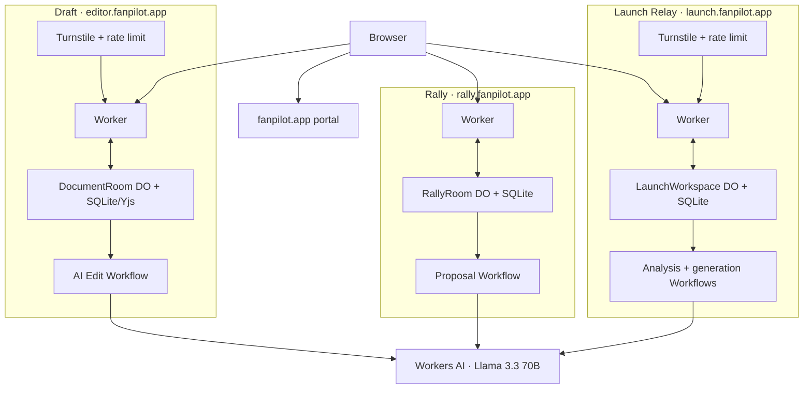

# Fanpilot Cloudflare AI apps

[](https://github.com/beejmaxx/fanpilot-cloudflare-ai-apps/actions/workflows/ci.yml)

Three independently deployed AI products built on Cloudflare's developer platform. Each app satisfies the assignment requirements on its own: an LLM, coordination, user input, and durable state. The [live challenge portal](https://fanpilot.app) explains the collection.

| Product | Live domain | What it does | Documentation |
| --- | --- | --- | --- |
| **Rally** | [rally.fanpilot.app](https://rally.fanpilot.app) | Turns group chat into event options, a vote, and a final plan | [Rally README](apps/rally/README.md) |
| **Draft** | [editor.fanpilot.app](https://editor.fanpilot.app) | Lets multiple people edit together and review AI-proposed changes | [Draft README](apps/editor/README.md) |
| **Launch Relay** | [launch.fanpilot.app](https://launch.fanpilot.app) | Turns release notes into source-linked, reviewable launch posts | [Launch Relay README](apps/relay/README.md) |

## Cloudflare AI application challenge

The challenge asks for an AI-powered application with an **LLM**, **workflow or coordination**, **chat or voice input**, and **memory or state**, plus disclosure of AI-assisted coding prompts. All three products satisfy the four technical components independently. The original assignment wording is preserved in the [shared prompt history](docs/shared/PROMPTS.md).

| Requirement | Rally | Draft | Launch Relay |
| --- | --- | --- | --- |
| **LLM** | Llama 3.3 extracts constraints and generates plans | Llama 3.3 creates bounded, reviewable edits | Llama 3.3 extracts release facts, answers clarification chat, and drafts posts |
| **Workflow / coordination** | Worker + proposal Workflow + one room Durable Object | Worker + AI edit Workflow + one document Durable Object | Worker + two AI Workflows + one launch-workspace Durable Object |
| **User input** | Multi-user chat and voting | Rich text, AI chat, comments, and live presence | Release source, fact review, post editing, and clarification chat |
| **Memory / state** | SQLite stores participants, messages, constraints, proposals, votes, and final plan | SQLite stores access, Yjs updates, comments, suggestions, revisions, and history | SQLite stores sources, facts, campaigns, post revisions, approvals, schedules, and audit history |

### Cloudflare products used and why

| Cloudflare product / capability | Role | Implementation evidence |
| --- | --- | --- |
| **Workers + Static Assets** | Serve each React UI and API from one edge deployment; the apex Worker serves the portfolio | [Rally](apps/rally/src/worker/index.ts), [Draft](apps/editor/src/worker/index.ts), [Relay](apps/relay/src/worker/index.ts), [portal](apps/portal/src/worker/index.ts) |
| **Workers AI** | Run `@cf/meta/llama-3.3-70b-instruct-fp8-fast`; model output is schema-checked before it reaches shared state | [Rally AI](apps/rally/src/worker/ai.ts), [Draft AI](apps/editor/src/worker/ai.ts), [Relay AI](apps/relay/src/worker/ai.ts) |
| **Workflows** | Run retryable, version-aware jobs away from realtime interaction | [Rally Workflow](apps/rally/src/worker/workflow.ts), [Draft Workflow](apps/editor/src/worker/workflow.ts), [Relay Workflows](apps/relay/src/worker/workflow.ts) |
| **Durable Objects + SQLite** | Give each room, document, or launch workspace one authoritative coordinator and colocated durable database | [Rally room](apps/rally/src/worker/room.ts), [Draft document](apps/editor/src/worker/room.ts), [Relay workspace](apps/relay/src/worker/room.ts) |
| **WebSocket Hibernation API** | Broadcast committed collaboration updates while allowing idle objects to sleep | Socket handlers in each Durable Object above |
| **Turnstile** | Protect public Draft-document and Launch-Relay workspace creation | [Draft verification](apps/editor/src/worker/turnstile.ts), [Relay verification](apps/relay/src/worker/turnstile.ts) |
| **Workers Rate Limiting** | Bound repeated public creation after Turnstile verification | Bindings in [Draft config](apps/editor/wrangler.jsonc) and [Relay config](apps/relay/wrangler.jsonc) |
| **Durable Object alarms** | Recalculate when Relay posts become due without an always-on process | Alarm handler in [Relay workspace](apps/relay/src/worker/room.ts) |
| **Observability** | Enable runtime logs and failure visibility for every deployed Worker | `observability` in each app's Wrangler configuration |

The challenge suggests Pages and Realtime for user input. These implementations use Workers Static Assets and Durable Object WebSockets directly. No external database is required: application state lives in Durable Object SQLite.

### What a reviewer can observe

1. Open [Rally](https://rally.fanpilot.app), create a room, join through an invitation in a private window, add preferences, generate options, vote, and finalize.
2. Open [Draft](https://editor.fanpilot.app), create a document, share an editor invitation, collaborate in a second window, ask AI for a change, and accept or reject its proposed diff.
3. Open [Launch Relay](https://launch.fanpilot.app), load the sample or paste a public GitHub repository or exact release URL, confirm the extracted facts, generate three posts, approve and schedule them, then change a fact to see approval invalidation.
4. Review the separated [AI-assisted development prompt histories](PROMPTS.md).

Local suites use deterministic model fixtures so application behavior is repeatable. Production smoke testing exercises the real Workers AI bindings.

## Domains

- `https://fanpilot.app` — portfolio and challenge conformance portal
- `https://rally.fanpilot.app` — Rally
- `https://editor.fanpilot.app` — Draft
- `https://launch.fanpilot.app` — Launch Relay

Legacy Rally URLs at `fanpilot.app/room/...` and `fanpilot.app/join/...` redirect to the Rally subdomain while preserving path, query, and private URL fragment.

## Architecture



Each Durable Object serializes mutations, persists them before acknowledgement, and broadcasts committed state. Workflows capture immutable inputs and commit validated results only when their expected versions are still current.

## Access and safety model

Private participant links use 256-bit secrets in URL fragments. Only SHA-256 hashes are stored. The client consumes the fragment, authenticates it through the API or WebSocket, and removes it from the visible address bar. A bare UUID grants no access; invitations create distinct identities even when people choose the same display name.

AI output is treated as a proposal. Server-side schemas, source-excerpt validation, version checks, dependency fingerprints, and explicit human approval prevent model output or stale jobs from silently replacing shared work. Launch Relay does not auto-publish to social networks: scheduling produces an in-app due state, and users manually record a publication URL.

## Repository layout

```text
apps/
  portal/                 Challenge portfolio at the apex domain
  rally/                  Group planner client, Worker, Workflow, DO, and tests
  editor/                 Collaborative editor client, Worker, Workflow, DO, and tests
  relay/                  Launch campaign client, two Workflows, DO, and tests
docs/
  shared/                 Assignment and repository prompt history
  rally/                  Rally design, screenshots, and prompt history
  editor/                 Draft plan and prompt history
  relay/                  Launch Relay plan and prompt history
.github/workflows/ci.yml  Independent jobs for all products and the portal
```

## Local development and validation

Use Node.js 26.8.2 from [`.nvmrc`](.nvmrc):

```bash
nvm use
npm ci
npm run dev:rally
npm run dev:editor
npm run dev:relay
npm run dev:portal
```

Workers AI has no local emulator. Each product uses deterministic local responses for complete offline browser journeys. Local Playwright launches installed Brave; CI uses Playwright Chromium, the same browser engine.

```bash
npm test
npm run build
npm run test:e2e:rally
npm run test:e2e:editor
npm run test:e2e:relay
```

CI runs the three products independently and uploads Playwright reports on failure. The suites cover two-client collaboration, persistence, scoped access, invitation replay, concurrency, AI proposal review, stale-result protection, approval invalidation, Turnstile behavior, keyboard interaction, mobile layouts, console errors, and serious accessibility violations.

## Deployment and configuration

```bash
npm run deploy:rally
npm run deploy:editor
npm run deploy:relay
npm run deploy:portal
```

The public Turnstile site keys and expected hostnames are declared in the Draft and Relay Wrangler configs. Their matching `TURNSTILE_SECRET_KEY` values are stored as Cloudflare Worker secrets and never committed. Every product has independent Worker, Workflow, Durable Object, migration, binding, and deployment identities.

## AI-assisted development disclosure

Prompt history is separated by scope so reviewers can follow each product without mixing development threads:

- [Shared assignment and repository prompts](docs/shared/PROMPTS.md)
- [Rally prompts](docs/rally/PROMPTS.md)
- [Draft prompts](docs/editor/PROMPTS.md)
- [Launch Relay prompts](docs/relay/PROMPTS.md)

[`PROMPTS.md`](PROMPTS.md) is the disclosure index. Temporary authentication codes are intentionally omitted; product prompts are otherwise reproduced in their original wording.
