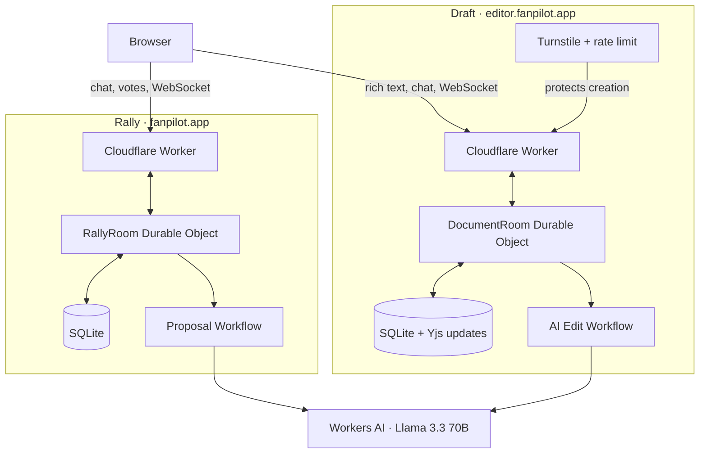

# Fanpilot Cloudflare AI apps

[](https://github.com/beejmaxx/fanpilot-cloudflare-ai-apps/actions/workflows/ci.yml)

Two complete, independently deployed AI products built on Cloudflare's developer platform. Each app satisfies the assignment requirements on its own: an LLM, coordination, user input, and durable state.

| Product | Live domain | What it does | App documentation |
| --- | --- | --- | --- |
| **Rally** | [fanpilot.app](https://fanpilot.app) | Turns a group chat into event options, a vote, and a final plan | [Rally README](apps/rally/README.md) |
| **Draft** | [editor.fanpilot.app](https://editor.fanpilot.app) | Lets multiple people edit together and review AI-proposed document changes | [Draft README](apps/editor/README.md) |

## Assignment coverage

| Requirement | Rally | Draft |
| --- | --- | --- |
| **LLM** | Llama 3.3 70B through Workers AI extracts constraints and generates plans | Llama 3.3 70B through Workers AI creates bounded, reviewable edits |
| **Workflow / coordination** | A Worker routes requests, a Workflow generates versioned proposals, and one Durable Object coordinates each room | A Worker routes requests, a Workflow runs AI edits, and one Durable Object coordinates each document |
| **User input** | Multi-user chat and voting over HTTP and hibernating WebSockets | Tiptap rich-text editing, AI chat, comments, and presence over HTTP and hibernating WebSockets |
| **Memory / state** | Durable Object SQLite stores participants, messages, preferences, proposals, votes, and the final plan | Durable Object SQLite stores access, Yjs updates, comments, suggestions, revisions, and audit history |

Both products use Cloudflare Workers, Workers AI, Workflows, SQLite-backed Durable Objects, static assets, and observability. Draft also uses Turnstile and a Worker Rate Limiting binding to protect public document creation.

## Domains

- `https://fanpilot.app` is the apex domain and serves **Rally**.
- `https://editor.fanpilot.app` is a Worker Custom Domain and serves **Draft**.

The domains point to separate Workers with separate Durable Object classes, Workflows, storage, and deployments. Neither app proxies through the other.

## Architecture



Each room or document is addressed to one Durable Object. That object serializes mutations, persists them before acknowledgement, and broadcasts committed state. The AI Workflows operate outside the realtime typing path and commit only validated results.

## Reviewer quick start

1. Open [Rally](https://fanpilot.app), create a room, copy the invitation link, and join from a private window. Add preferences, generate options, vote, and finalize.
2. Open [Draft](https://editor.fanpilot.app), pass the creation check, create a document, and use **Share** to copy an editor invitation or your private return link. Collaborate in a second window, ask AI for a change, then accept or reject the proposed diff.
3. Review the app-specific architecture and access decisions in the [Rally README](apps/rally/README.md) and [Draft README](apps/editor/README.md).
4. Review the disclosed [AI-assisted development prompts](PROMPTS.md).

Private participant links use secrets in URL fragments. The app consumes the secret, authenticates it through the API or WebSocket, and removes it from the visible address bar. A bare room or document UUID does not grant access; copy links from each app's **Invite** or **Share** dialog.

## Repository layout

```text
apps/
  rally/                  Rally client, Worker, Workflow, Durable Object, and tests
  editor/                 Draft client, Worker, Workflow, Durable Object, and tests
docs/
  rally/                  Rally design, screenshots, and prompt history
  editor/                 Draft implementation plan and prompt history
  shared/                 Assignment and repository-level prompt history
.github/workflows/ci.yml  Independent Rally and Draft CI jobs
```

This is an npm workspace with one lockfile. The apps deliberately keep their schemas, bindings, runtime resources, tests, and deploy commands independent.

## Local development

Use Node.js 26.8.2 from [`.nvmrc`](.nvmrc):

```bash
nvm use
npm ci
npm run dev:rally
# or, in another terminal
npm run dev:editor
```

Workers AI has no local emulator. Both apps use deterministic local responses so their complete interaction flows can be tested without presenting fixtures as production inference. Rally can opt into remote bindings with `CLOUDFLARE_REMOTE_BINDINGS=true npm run dev:rally`.

## Validation

```bash
# Unit/integration tests and production builds for both apps
npm test
npm run build

# Browser journeys (Brave locally; Playwright Chromium in GitHub Actions)
npm run test:e2e:rally
npm run test:e2e:editor
```

CI runs each application as an independent job and uploads Playwright reports on failure. Rally has 12 end-to-end scenarios; Draft has 17. Together they cover two-client collaboration, persistence, access control, token rotation, invitation handling, concurrency, AI proposal review, stale-edit protection, Turnstile failure/retry behavior, creation rate limiting, mobile behavior, and serious accessibility violations.

## Deployment and configuration

Deployments are always app-specific:

```bash
npm run deploy:rally
npm run deploy:editor
```

Rally needs no application secrets. Draft's public Turnstile site key and expected hostname are declared in [`apps/editor/wrangler.jsonc`](apps/editor/wrangler.jsonc); its matching `TURNSTILE_SECRET_KEY` is stored as a Cloudflare Worker secret and is never committed. Resource declarations live with each app:

- [`apps/rally/wrangler.jsonc`](apps/rally/wrangler.jsonc)
- [`apps/editor/wrangler.jsonc`](apps/editor/wrangler.jsonc)

## AI-assisted development disclosure

The prompt history is separated by scope so reviewers can follow each product without mixing two development threads:

- [Shared assignment and repository prompts](docs/shared/PROMPTS.md)
- [Rally prompts](docs/rally/PROMPTS.md)
- [Draft prompts](docs/editor/PROMPTS.md)

[`PROMPTS.md`](PROMPTS.md) is the disclosure index. Temporary authentication codes are intentionally omitted; product prompts are otherwise reproduced in their original wording.
