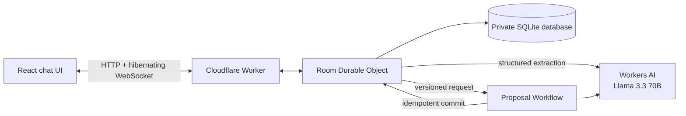

# Rally

**Make the plan, together.**

Rally is an AI group planner for dinners, outings, game nights, day trips, and other small events. An organizer starts a room with one sentence, invites friends, and lets everyone contribute naturally through chat. Rally extracts the group's hard constraints and preferences, creates three viable plans, runs a vote, and preserves the final decision.


## Why this exists

Group plans often fail in the gap between conversation and decision. Preferences are scattered through chat, hard constraints are easy to miss, and nobody wants to reconcile the group manually.

Rally keeps the conversation as the input while maintaining a live, structured plan beside it. Every room is durable: participants can disconnect, refresh, and return without reconstructing what happened.

## Assignment requirements

| Requirement | Rally implementation |
| --- | --- |
| LLM | Llama 3.3 70B through Workers AI, using JSON Mode for structured extraction and proposal generation |
| Workflow / coordination | A Cloudflare Workflow creates a versioned proposal set; a Worker routes requests; one Durable Object serializes each room |
| Chat or voice input | Multi-user chat with hibernating WebSockets for realtime room updates |
| Memory or state | A private SQLite database attached to each room's Durable Object |

## Product flow

1. The organizer describes an event and receives an invitation link.
2. Participants join with a display name and state their availability, budget, location, accessibility needs, dietary needs, and preferences.
3. Llama 3.3 converts relevant messages into structured constraints, preserving the source participant and message.
4. The organizer starts proposal generation.
5. A Workflow snapshots the room version, generates three options, and commits them only if the room has not changed underneath it.
6. Each participant casts one vote. Re-voting moves that vote.
7. The organizer confirms the final plan.
8. Chat, constraints, proposals, votes, and the final plan survive reconnects and Durable Object restarts.

## Architecture



The Durable Object is both the room's coordinator and the only process allowed to mutate its database. Important state is committed before it is broadcast. WebSocket connections use Cloudflare's Hibernation API, allowing idle rooms to sleep without disconnecting clients.

The Workflow uses a captured `state_version`. If a participant changes the room while proposals are being generated, the stale result cannot silently replace newer state. Workflow and message identifiers also make retries idempotent.

## Data model

Each room owns an independent SQLite database containing:

- `room`: stage, state version, workflow status, and final proposal;
- `participants`: role, RSVP status, and hashed room-session token;
- `messages`: durable chat history with client idempotency IDs;
- `constraints`: normalized facts linked to their source message and participant;
- `proposal_sets` and `proposals`: versioned AI-generated options;
- `votes`: one current choice per participant;
- `room_events`: an ordered audit stream;
- `workflow_runs`: durable execution references and outcomes.

Raw room tokens are never stored. WebSocket sessions send the opaque token as a subprotocol value so it does not appear in request URLs or routine access logs.

## Local development

Requirements:

- Node.js 26.8.2 (see `.nvmrc`)
- npm
- A Cloudflare account only when exercising remote Workers AI or deploying

```bash
npm install
npm run dev
```

Open `http://localhost:5173`.

Workers AI does not have a local emulator. By default, Rally catches the unavailable binding and uses deterministic extraction and proposal fallbacks so the complete room lifecycle remains testable offline.

To use the real Llama binding during local development, authenticate Wrangler, provide a suitable `CLOUDFLARE_API_TOKEN`, and enable remote bindings:

```bash
CLOUDFLARE_REMOTE_BINDINGS=true npm run dev
```

Remote inference can consume the Workers AI allocation associated with that Cloudflare account.

## Validation

```bash
npm test
npm run build
```

The implementation has also been exercised against the local Cloudflare runtime through the complete create → join → message → Workflow → vote → finalize lifecycle, including authenticated WebSocket reconnects and permission failures. Desktop and mobile UI verification was performed in Brave with a clean browser console.

## Deployment

Authenticate once, then deploy the Worker, static assets, Durable Object migration, Workflow, and Workers AI binding together:

```bash
npx wrangler login
npm run deploy
```

No model API key is stored in the application. The deployed Worker receives Workers AI through the `AI` binding declared in [`wrangler.jsonc`](wrangler.jsonc).

## Deliberate MVP boundaries

The current product coordinates a group using their supplied constraints. It does not claim to verify venue availability, prices, reservations, or addresses. Venue search, maps, email/SMS reminders, calendars, payments, accounts, and public event discovery remain outside the assignment scope.

This keeps the core demonstration focused on durable coordination: multiple users, realtime state, structured LLM output, recoverable Workflows, voting, and persistent memory.

## Project documentation

- [Product and technical design](docs/product-design.md)
- [AI prompt history](PROMPTS.md)
- [Mobile room preview](docs/rally-room-mobile.png)

The prompt history is kept chronologically because AI-assisted coding disclosure is part of the assignment.
