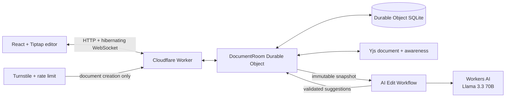

# Draft

**Write together. Let AI propose, never overwrite.**

**Live demo:** [editor.fanpilot.app](https://editor.fanpilot.app)

Draft is a collaborative rich-text editor for small teams writing product specs, proposals, and shared documents. Multiple people edit the same Yjs document in realtime, discuss changes, and ask Llama 3.3 to suggest targeted revisions. AI output stays separate from the document until a human accepts it.

## Assignment requirements

| Requirement | Draft implementation |
| --- | --- |
| LLM | Llama 3.3 70B through Workers AI returns schema-validated rewrite suggestions |
| Workflow / coordination | A Cloudflare Workflow runs recoverable AI jobs; a Worker routes requests; one Durable Object coordinates each document |
| User input | Tiptap rich-text editing, comments, shared AI chat, and live presence over hibernating WebSockets |
| Memory or state | Durable Object SQLite stores Yjs updates, participants, invitations, comments, chat, suggestions, revisions, and audit events |

## Product flow

1. The creator passes a managed Turnstile check and starts a blank document, product spec, or proposal.
2. Draft creates a durable document and gives the owner a private return link.
3. The owner shares a single-use editor or viewer invitation. The new participant receives a distinct private return link after joining.
4. Tiptap and Yjs merge concurrent human edits while the document Durable Object persists and broadcasts updates.
5. A participant selects one or more paragraphs and asks AI for a change.
6. An AI Workflow captures the server's current snapshot and returns bounded before/after suggestions.
7. Editors accept or reject each suggestion. Stale suggestions refuse to overwrite newer human work.
8. Comments, revision history, document state, and participant access survive refreshes and Durable Object restarts.

## Access model

Draft has no global accounts or email dependency. Display names are editable presentation data, so two people can use the same name while remaining separate participants.

- **Invitation links** grant a new owner-approved editor or viewer identity and are single use.
- **Private return links** restore one existing participant on another browser or device.
- The **Share** dialog is the source for both kinds of link. The normal address bar intentionally becomes tokenless after authentication.

Access tokens contain 256 bits of randomness. Only SHA-256 hashes are stored by the Durable Object, and secrets travel in URL fragments so they are not sent in initial HTTP requests or normal server access logs. A bare document UUID does not grant access. Participants can rotate their own return link, and owners can revoke collaborators and invitations; affected WebSockets are closed immediately.

## Architecture



The Durable Object is the only process that mutates a document's SQLite database. It authenticates each socket, persists Yjs updates before acknowledging them, and restores the canonical Yjs document after hibernation or restart.

The AI Workflow is outside the keystroke path. It receives a fixed server-owned snapshot, calls the model, validates the structured response, and saves suggestions without changing document content. Acceptance is a separate authorized command that rechecks the target paragraph and applies one minimal Yjs transaction.

## Concurrency and conflict handling

- Yjs CRDT updates let concurrent typing converge without a central lock.
- Every submitted update has a client idempotency key; duplicate delivery is safe.
- Reconnects exchange state vectors and recover missing updates.
- AI suggestions target stable paragraph IDs and include a fingerprint of the original rich content.
- A selected-paragraph suggestion can be accepted only while that paragraph still matches its captured input.
- A document-wide proposal becomes stale after an external content edit.
- Concurrent acceptance is serialized and applies once. **Accept all** validates every pending suggestion before applying the set atomically.

This protects human work without claiming semantic conflict resolution. Two valid human edits can still produce awkward prose, just as they can in any realtime editor.

## Data model

Each document owns an independent SQLite database containing:

- `documents`: title, content sequence, schema version, and lifecycle metadata;
- `participants` and `invitations`: roles, revocation, expiry, and hashed secrets;
- `y_updates` and `y_checkpoints`: durable collaborative document history;
- `chat_messages` and `comments`: attributed discussion and paragraph feedback;
- `ai_jobs` and `suggestions`: captured inputs, Workflow state, diffs, and decisions;
- `revisions`: checkpoints around accepted AI changes;
- `audit_events`: ordered access and content decisions.

Ephemeral cursor presence stays outside SQLite. No external application database or paid collaboration service is required.

## Public-demo protection

Managed Turnstile runs only when a new document is created. The server calls Siteverify and requires the `create-document` action plus the production hostname before allocating a document ID or Durable Object. A Worker Rate Limiting binding permits ten verified creations per client address per minute. Joining, editing, commenting, and reviewing suggestions do not show a challenge.

## Local development

Requirements:

- Node.js 26.8.2 (see the repository [`.nvmrc`](../../.nvmrc))
- npm
- Brave Browser for local end-to-end tests
- A Cloudflare account only for deployment

```bash
npm ci
npm run dev:editor
```

Open the Vite URL shown in the terminal. Localhost uses Cloudflare's published Turnstile test keys. Production credentials are never needed locally.

## Validation

```bash
npm run test:editor
npm run build:editor
npm run test:e2e:editor
```

The 17 Playwright scenarios cover Turnstile enforcement and retry, creation rate limiting, persistence, same-name collaborators, Yjs convergence, one-time invitations, comments, single and batch AI proposals, stale and concurrent acceptance, viewer permissions, active revocation, return-link rotation and recovery, bare-ID denial, and serious accessibility violations.

Playwright launches the installed Brave executable locally. GitHub Actions runs the same suite in Playwright Chromium, the rendering engine Brave uses. Set `BRAVE_PATH` if Brave is installed elsewhere:

```bash
BRAVE_PATH=/path/to/brave npm run test:e2e:editor
```

## Deployment

The public site key and expected hostname are non-secret Wrangler variables. Configure the matching private key once, then deploy:

```bash
cd apps/editor
npx wrangler secret put TURNSTILE_SECRET_KEY
cd ../..
npm run deploy:editor
```

The Worker, assets, Durable Object, Workflow, Workers AI binding, rate limit, and custom domain are declared in [`wrangler.jsonc`](wrangler.jsonc).

## Deliberate proof-of-concept boundaries

Draft does not include accounts, email recovery, pagination, tables, images, attachments, Word import, arbitrary inline comment ranges, or offline-first editing. It supports Markdown and plain-text export rather than external storage integrations. The proof focuses on realtime multi-user state, durable recovery, scoped access, safe AI change review, and Cloudflare-native coordination.

## Project documentation

- [Implementation plan and technical design](../../docs/editor/implementation-plan.md)
- [AI prompt history](../../docs/editor/PROMPTS.md)
- [Repository overview](../../README.md)
