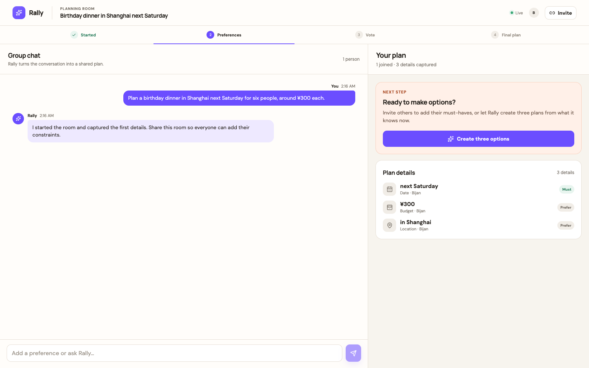
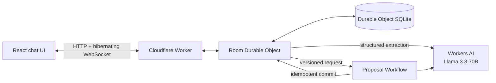

# Rally

**Make the plan, together.**

**Live demo:** [fanpilot.app](https://fanpilot.app)

Rally is an AI group planner for dinners, outings, meetups, game nights, and day trips. An organizer starts a room with one sentence, invites friends, and lets everyone contribute through chat. Rally extracts constraints and preferences, creates three viable plans, runs a vote, and preserves the final decision.



## Assignment requirements

| Requirement | Rally implementation |
| --- | --- |
| LLM | Llama 3.3 70B through Workers AI, with schema-validated structured extraction and proposal generation |
| Workflow / coordination | A Cloudflare Workflow creates a versioned proposal set; a Worker routes requests; one Durable Object serializes each room |
| User input | Multi-user chat with hibernating WebSockets for realtime updates |
| Memory or state | Durable Object SQLite stores the room, participants, chat, constraints, proposals, votes, invitations, and final plan |

## Product flow

1. The organizer describes an event and enters a display name.
2. Rally creates a durable room and a private return link for the organizer.
3. The organizer copies a separate invitation link. Each participant chooses a display name and receives their own private return link.
4. Llama 3.3 converts relevant messages into structured constraints with source attribution.
5. A Workflow snapshots the room version, generates three options, and commits them only if the room has not changed underneath it.
6. Participants vote and the organizer confirms the final plan.
7. The room survives refreshes, disconnects, and Durable Object restarts.

No account or email is required. Display names are presentation data, so two people can use the same name while remaining distinct participants.

## Access model

Rally uses two room-scoped secrets:

- **Invitation link:** `/join/<room-id>#invite=<token>` lets a new person create a participant identity.
- **Private return link:** `/room/<room-id>#access=<token>` restores exactly that participant on any browser.

Tokens contain 256 bits of randomness. Only SHA-256 hashes are stored in the room database. URL fragments are not sent in HTTP requests or routine server access logs. A bare room UUID grants no access. Organizers can reset invitations, and any participant can rotate their private return link.

The browser stores recent rooms locally for convenience. Cross-device recovery uses the private return link itself, so users should keep it private.

## Architecture



The Durable Object is the room coordinator and the only process allowed to mutate its SQLite database. State is committed before it is broadcast. WebSocket hibernation lets idle rooms sleep without losing their state.

The Workflow captures a `state_version`. If the room changes while proposals are being generated, a stale result cannot replace newer state. Workflow and message identifiers make retries idempotent.

## Data model

Each room owns an independent SQLite database containing:

- `room`: stage, state version, workflow status, and final proposal;
- `participants`: display name, role, RSVP status, and hashed private access token;
- `invitations`: hashed invitation tokens, expiry, and revocation state;
- `messages`: durable chat history with client idempotency IDs;
- `constraints`: normalized facts linked to their source message and participant;
- `proposal_sets` and `proposals`: versioned AI-generated options;
- `votes`: one current choice per participant;
- `room_events`: an ordered audit stream;
- `workflow_runs`: durable execution references and outcomes.

No separate application database is required for the MVP.

## Local development

Requirements:

- Node.js 26.8.2 (see the repository [`.nvmrc`](../../.nvmrc))
- npm
- Brave Browser for local end-to-end tests
- A Cloudflare account only for remote Workers AI or deployment

```bash
npm install
npm run dev:rally
```

Open `http://localhost:5173`.

Workers AI has no local emulator. Rally uses deterministic extraction and proposal fallbacks locally so the complete lifecycle remains testable offline. To exercise the real binding locally:

```bash
CLOUDFLARE_REMOTE_BINDINGS=true npm run dev:rally
```

## Validation

```bash
npm run test:rally
npm run build:rally
npm run test:e2e:rally
```

The Playwright suite launches the installed Brave executable locally. GitHub Actions runs the same suite in Playwright Chromium, the rendering engine Brave uses. Its twelve scenarios cover the full two-person create → join → message → Workflow → vote → finalize journey; invitation enforcement; same-name participants; fresh-browser identity restoration; fragment secrecy; editable names; return-link rotation; invitation reset; role enforcement; vote replacement; persistence; WebSocket recovery; concurrency; invalid input; mobile layout; console errors; and serious accessibility violations.

Set `BRAVE_PATH` when Brave is installed elsewhere:

```bash
BRAVE_PATH=/path/to/brave npm run test:e2e:rally
```

After deploying, run the real Workers AI smoke test:

```bash
RALLY_BASE_URL=https://fanpilot.app npm run test:smoke:access-remote --workspace=@fanpilot/rally
RALLY_BASE_URL=https://fanpilot.app npm run test:smoke:remote --workspace=@fanpilot/rally
```

## Deployment

Authenticate Wrangler, then deploy the Worker, static assets, Durable Object, Workflow, and Workers AI binding:

```bash
npx wrangler login
npm run deploy:rally
```

No model, email, or database API key is stored in the application. Cloudflare resources are declared in [wrangler.jsonc](wrangler.jsonc).

## Deliberate MVP boundaries

Rally does not verify venue availability, prices, reservations, or addresses. Venue search, maps, reminders, calendars, payments, email recovery, and public event discovery remain outside the assignment scope. The core demonstration stays focused on multi-user coordination, realtime state, structured LLM output, recoverable Workflows, voting, and persistent memory.

## Project documentation

- [Product and technical design](../../docs/rally/product-design.md)
- [AI prompt history](../../PROMPTS.md)
- [Mobile room preview](../../docs/rally/rally-room-mobile.png)

The prompt history is chronological because AI-assisted coding disclosure is part of the assignment.
