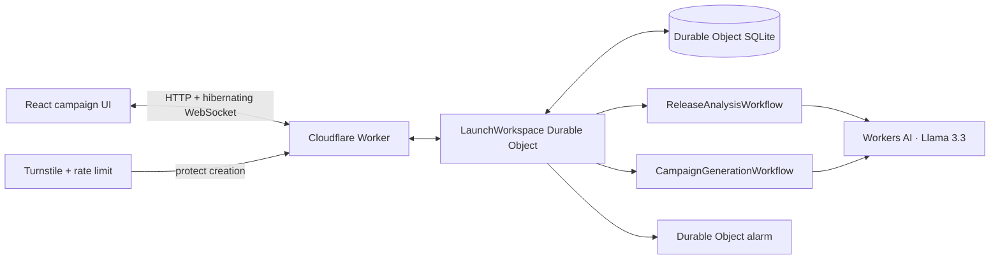

# Launch Relay

**Turn what you shipped into a launch you can confidently share.**

**Live demo:** [launch.fanpilot.app](https://launch.fanpilot.app)

Launch Relay helps a small software team convert pasted release notes or a public GitHub repository into three accurate launch posts. Given a repository URL, it finds the latest published release with useful notes and records the exact release it selected; an exact release URL pins a specific tag. People confirm the extracted facts, edit and approve each post, schedule an in-app due state, and preserve a revision trail when facts change.

## Assignment requirements

| Requirement | Launch Relay implementation |
| --- | --- |
| LLM | Llama 3.3 70B through Workers AI extracts source-backed facts, answers clarification chat, and drafts structured posts |
| Workflow / coordination | Separate release-analysis and campaign-generation Workflows; one Worker and one `LaunchWorkspace` Durable Object coordinate each workspace |
| User input | Release source, fact confirmation, plain-text post editing, approvals, invitations, and clarification chat over HTTP and hibernating WebSockets |
| Memory / state | Durable Object SQLite stores product context, immutable sources, facts and revisions, posts and revisions, dependencies, approvals, schedules, publications, chat, jobs, and audit events |

## Product flow

1. Pass managed Turnstile, describe the product, and paste notes, a public GitHub repository URL, or an exact release URL.
2. The analysis Workflow asks Llama 3.3 for structured facts. Exact source excerpts are checked before storage.
3. Edit and explicitly confirm each fact, including availability, which release notes alone cannot prove.
4. The generation Workflow creates a LinkedIn announcement, X announcement, and LinkedIn follow-up from confirmed facts.
5. Edit, approve, and assign a planned time to each post. Planned posts become due in the app; nothing is posted automatically.
6. Change a supporting fact. Dependent approvals become `needs changes`, while the approved and published revisions remain in history.
7. Invite an editor or viewer, use chat to clarify the release, and return through a private identity link.

## Correctness and access model

The application uses optimistic versions for fact and post edits. Workflows capture immutable job inputs and cannot overwrite newer human work. Approvals bind an exact post revision and a fingerprint of its fact revisions. A dependency change invalidates approval, and a change after manual publication creates a correction task.

Private return and one-time invitation tokens contain 256 bits of randomness. Only SHA-256 hashes are stored. Tokens travel in URL fragments and are removed from the address bar after the browser consumes them. Owner, editor, and viewer roles are enforced inside the Durable Object; a bare workspace UUID grants no access.

GitHub import accepts public `github.com/<owner>/<repo>` and exact `github.com/<owner>/<repo>/releases/tag/<tag>` URLs and calls the official GitHub API. A repository URL selects the latest non-draft release with useful notes; if releases have no notes, Relay can use the latest tag and a root changelog. Arbitrary hosts and redirects are rejected. Imported text is treated as untrusted content, never as permission or approval instructions.

## Cloudflare architecture



One Durable Object owns each workspace, keeping fact revisions, post dependencies, approvals, and publication history transactional. Alarms persist the next planned time and recompute due status idempotently. Workers observability captures production logs and failures.

## Local development

```bash
nvm use
npm ci
npm run dev:relay
```

Open `http://localhost:5173`. Local development uses Cloudflare's documented Turnstile test keys and deterministic AI fixtures. Set `BRAVE_PATH` if Brave is installed somewhere Playwright does not discover automatically.

## Validation

```bash
npm run test:relay
npm run build:relay
npm run test:e2e:relay
```

The Playwright suite uses Brave locally and Chromium in GitHub Actions. It covers the full create → analyze → confirm → generate → reload journey, fact-based approval invalidation, private-link restoration, bare-ID denial, one-time viewer invitations and role enforcement, Enter/Shift+Enter chat behavior, and serious accessibility violations.

## Deployment

```bash
npm run deploy:relay
npx wrangler secret put TURNSTILE_SECRET_KEY --config apps/relay/wrangler.jsonc
```

The public site key is declared in [wrangler.jsonc](wrangler.jsonc); the matching secret exists only in Cloudflare. Release data, campaign memory, and AI jobs use Cloudflare bindings, so no external database or model API key is required.

## Deliberate proof-of-concept boundaries

Launch Relay does not connect private repositories, poll for source changes, publish to social networks, send notifications, create media, or measure attribution. Planned times create a durable in-app due state. A manually recorded publication is an assertion from the user, and a later source change produces a correction task rather than claiming to edit the remote post.

- [Product and implementation plan](../../docs/relay/implementation-plan.md)
- [AI prompt history](../../docs/relay/PROMPTS.md)
