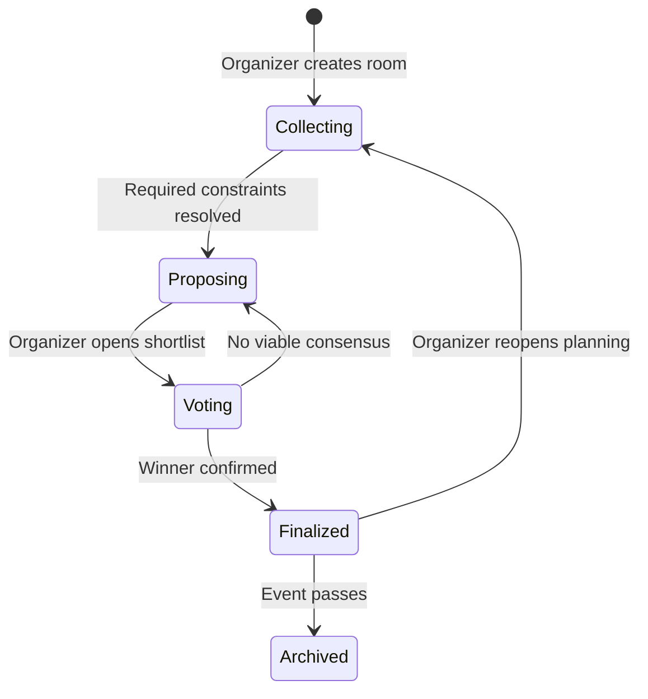
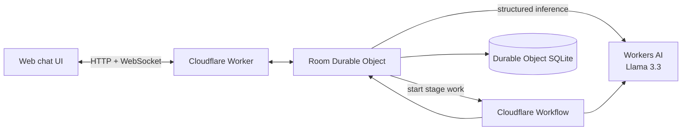

# Rally product design

Status: MVP deployed and verified with Workers AI

## Product promise

Rally helps a small group turn scattered preferences into one confirmed plan.

An organizer describes an event in one sentence, shares a room, and lets Rally collect availability and preferences through a group chat. Rally keeps a structured planning board beside the conversation, surfaces conflicts, proposes viable options, runs a vote, and publishes the final plan.

Working tagline: **Make the plan, together.**

## Audience and initial use cases

Rally is for groups of 3–12 people arranging one-off social plans:

- dinner or brunch;
- a game night or watch party;
- a hike or day trip;
- a birthday activity;
- an informal meetup.

The initial wedge is a plan that currently happens through a noisy group chat, where preferences are easy to miss and no one wants to make the final decision.

## Core user story

> As an organizer, I want everyone to contribute preferences without manually compiling them, so our group can agree on a concrete plan.

Example prompt:

> Plan a birthday dinner in Shanghai next Saturday for six people. Keep it near Jing'an and around ¥300 per person.

Rally creates a room, extracts the known constraints, asks only the questions needed to complete the plan, and provides an invitation link. Each participant can respond conversationally. The room updates in real time as the agent converts messages into structured constraints.

## Design principles

1. **One shared truth.** Chat is the input; the planning board is the current state.
2. **The agent shows its work.** Every constraint records who supplied it and whether it is confirmed.
3. **The group stays in control.** Rally proposes and explains; participants decide.
4. **Progress is visible.** The room always shows the next missing decision.
5. **Returning should feel continuous.** Refreshing or reconnecting restores the entire room.
6. **Structure emerges from conversation.** Participants should not have to complete a long form before they can contribute.

## Room lifecycle



### Collecting

Rally gathers attendance, availability, location, budget, accessibility needs, dietary needs, and preferences. It highlights missing answers and conflicts without repeatedly asking questions already answered.

### Proposing

Rally generates up to three options that satisfy the strongest confirmed constraints. Each option explains its tradeoffs and lists any uncertainty.

### Voting

Participants vote for one option and may explain objections. Rally summarizes consensus and flags blocking objections separately from preferences.

### Finalized

The room becomes a concise plan: time, place, attendees, itinerary, assignments, and unresolved details. The organizer can reopen the room if circumstances change.

## Roles

### Organizer

- creates and names the room;
- shares the invitation link;
- advances or reopens the planning stage;
- confirms the final plan;
- can correct any extracted constraint.

### Participant

- joins with a display name;
- chats with the group and Rally;
- confirms attendance and preferences;
- votes on proposed plans;
- sees how their input affected the result.

### Rally

- extracts structured facts from messages;
- asks targeted follow-up questions;
- identifies conflicts and missing inputs;
- creates a shortlist with rationale;
- summarizes discussion without inventing agreement;
- preserves provenance for every important decision.

## Primary screens

### Landing and room creation

The landing page contains one primary input: “What are you planning?” It offers a few example prompts and creates a room immediately. Account creation is outside the first-run path.

### Join screen

A guest follows a room link, enters a display name, and joins. The page shows the event title and organizer before entry. A room-specific guest token preserves identity on return.

### Planning room

The main product surface has two synchronized regions:

- **Conversation:** participant messages, Rally questions, decisions, and lightweight system events.
- **Plan board:** stage, participants, confirmed constraints, conflicts, options or final plan, and the current next step.

On narrow screens, the conversation and plan board become two top-level tabs. The message composer remains reachable without obscuring the plan.

## MVP interaction flow

1. The organizer describes a plan.
2. Rally creates a durable room and extracts initial constraints.
3. The organizer copies the invitation link.
4. Participants join with display names and chat.
5. Rally updates structured constraints after each relevant message.
6. When required inputs are complete, a Workflow creates a shortlist.
7. The organizer opens voting.
8. Participants vote and discuss objections.
9. The organizer confirms the winning plan.
10. Rally produces a shareable final summary.

## Required and optional constraints

Required constraints are deliberately small:

- attendance;
- date or time window;
- general location;
- budget range when relevant;
- hard accessibility or dietary requirements.

Everything else is a preference. Rally must distinguish a blocker such as a severe allergy from a preference such as outdoor seating.

Each stored constraint has:

- a normalized type and value;
- `hard` or `soft` strength;
- participant ownership;
- source message;
- confirmation state;
- creation and update timestamps.

## AI responsibilities

The language model is used for:

- intent and constraint extraction;
- deciding the smallest useful follow-up question;
- conflict explanation;
- option generation from structured room state;
- discussion and final-plan summaries.

Application code remains authoritative for:

- permissions and identity;
- room stage transitions;
- vote counts;
- persistence;
- validation and schema enforcement;
- deduplication and idempotency.

All model-produced structured data must validate against explicit schemas before it can change room state. The source message remains linked to each accepted extraction.

## Cloudflare architecture



### Worker

Serves the application, creates rooms, resolves invitation links, and routes room traffic to the correct Durable Object.

### Room Durable Object

One Durable Object owns each room. It serializes room mutations, stores the canonical state in SQLite, manages connected clients, broadcasts updates, and invokes model or Workflow operations.

### Workflow

The first Workflow coordinates shortlist generation:

1. take a versioned snapshot of the room;
2. validate that minimum inputs are present;
3. generate candidate plans;
4. score candidates against hard and soft constraints;
5. persist viable options idempotently;
6. notify the room that proposals are ready.

Workflow instance IDs include the room ID and state version so retries cannot create duplicate proposal sets.

### Workers AI

Llama 3.3 performs conversational and structured inference. Prompts include a compact, server-generated room summary rather than an unbounded transcript. Recent messages are added only when relevant to the current operation.

## Initial data model

```text
Room
  id, title, organizer_id, stage, state_version
  event_kind, timezone, created_at, updated_at

Participant
  id, room_id, display_name, role, rsvp_status
  joined_at, last_seen_at

Message
  id, room_id, participant_id, client_id, kind, body
  created_at

Constraint
  id, room_id, participant_id, source_message_id
  type, normalized_value, strength, status
  created_at, updated_at

ProposalSet
  id, room_id, source_state_version, status, created_at

Proposal
  id, proposal_set_id, title, summary, structured_plan
  tradeoffs, created_at

Vote
  room_id, proposal_id, participant_id, value, reason
  created_at, updated_at

RoomEvent
  id, room_id, type, actor_id, payload, created_at

WorkflowRun
  id, room_id, source_state_version, workflow_instance_id
  kind, status, error, created_at, completed_at
```

`client_id` makes message submission idempotent. `state_version` prevents a Workflow result produced from stale input from silently replacing newer room state.

## Database and data placement

The primary database is **SQLite embedded in the room's Durable Object**. Each Rally room receives its own `RoomDurableObject` and therefore its own private, transactional SQLite database on Cloudflare's network.

The initial implementation does not need D1. The invitation URL contains a random room identifier that the Worker maps directly to the correct Durable Object. A separate scoped guest token authorizes a participant; the Durable Object ID itself is not treated as a credential.

Storage responsibilities are:

| Data | Location | Reason |
| --- | --- | --- |
| Room, participants, messages, constraints, proposals, votes, room events, workflow references | Durable Object SQLite | Canonical, strongly consistent room state next to the realtime coordinator |
| Active WebSocket connections and transient presence | Durable Object memory | Ephemeral connection state; reconstructed after restart or reconnect |
| Guest session token and last observed state version | Browser storage | Restores the participant identity and catches up after reconnect |
| Workflow execution checkpoints | Cloudflare Workflows | Durable execution and retries; final product state is still committed to the room database |
| Static application assets | Workers static assets | Globally served frontend |
| Large uploads, if added later | R2 | Object storage rather than relational room state |
| Cross-room user dashboard, if added later | D1 or a user-index Durable Object | Global query and discovery across independently stored rooms |

Important room state is written to SQLite before it is broadcast. In-memory fields may cache derived state, but they are never the sole copy because a Durable Object can restart or be evicted.

By default, Cloudflare places a new Durable Object near the request that first creates it. Rally should therefore instantiate a room only from the organizer's actual create request. A production version can apply a location hint for latency or use a jurisdiction-restricted namespace when data must stay in the EU, US, or another supported compliance boundary.

SQLite-backed Durable Objects also support point-in-time recovery. Rally should still provide explicit room deletion because recovery capability is not a user-facing retention policy.

## Realtime protocol

Clients receive ordered room events over WebSockets. The server includes the current state version in every event. On reconnect, a client sends its last observed version; the room returns missed events or a fresh snapshot.

Minimum event types:

- `message.created`;
- `participant.joined`;
- `participant.updated`;
- `constraint.upserted`;
- `constraint.removed`;
- `stage.changed`;
- `proposal_set.ready`;
- `vote.upserted`;
- `plan.finalized`.

## Trust and privacy

- Invitation links carry unguessable room identifiers.
- Room access uses scoped guest tokens rather than trusting display names.
- Participants can see and correct facts attributed to them.
- The interface labels AI proposals and summaries.
- Rally never presents inferred consensus as a completed vote.
- Raw model output is not broadcast or persisted as canonical state.
- Rooms expose deletion and participant-removal controls.

## Scope boundaries for the assignment

The first version excludes:

- public event discovery;
- ticket sales and payments;
- venue booking;
- calendar, email, SMS, and map integrations;
- recurring communities;
- native mobile applications;
- complex account management.

Seeded venue/activity options can make the demo deterministic. Real discovery can follow after the core planning loop works.

## Success criteria

The MVP is successful when:

1. three people can join the same room from separate browser sessions;
2. their messages appear in real time and survive reconnects;
3. Rally extracts editable constraints with message provenance;
4. the Workflow produces viable options exactly once for a room version;
5. participants can vote and finalize a plan;
6. reopening the room restores the conversation, constraints, votes, and final plan;
7. a reviewer can identify the LLM, coordination, input, and state components from the product experience and README.

## Cost model

Pricing snapshot: September 17, 2026. Confirm current Cloudflare pricing before launch.

Rally can be developed and demonstrated on the Workers Free plan. Static asset requests are free. The free allowances currently include 100,000 Worker requests per day, 100,000 Durable Object requests per day, 13,000 Durable Object GB-seconds per day, 5 GB of Durable Object SQLite data, 3,000 Workflow steps per day, and 10,000 Workers AI neurons per day. Free-plan services stop or reject operations at their limits instead of automatically charging overages.

For a public beta, use the Workers Paid plan. Its minimum account charge is $5 per month and it supplies substantially larger included allocations. Expected Rally traffic remains inside the included Worker, Workflow, Durable Object compute, and SQLite allowances for a small launch.

The selected Workers AI model, `@cf/meta/llama-3.3-70b-instruct-fp8-fast`, is currently priced at:

- $0.293 per million input tokens;
- $2.253 per million output tokens;
- 10,000 neurons per day included on both Free and Paid plans;
- $0.011 per 1,000 neurons beyond the daily allocation on Paid.

A representative completed event assumes approximately 22,900 total input tokens and 3,300 output tokens across extraction, clarification, proposal generation, and final summarization. That is about $0.014 of gross model usage, or roughly 1–5 cents per event allowing for longer conversations and retries.

| Usage scenario | Assumption | Estimated monthly Cloudflare cost |
| --- | --- | ---: |
| Assignment demo | Fewer than about 70 ordinary AI turns per day | $0 on Free |
| Small public beta | 100 completed events per month | $0 on Free, or $5 for Paid reliability |
| Early product | 1,000 completed events per month, spread across the month | About $16 including the $5 Paid minimum |
| Growing product | 10,000 completed events per month | About $143, dominated by Workers AI |

These estimates exclude a custom domain and third-party services. Venue search, maps, transactional email, SMS, calendar providers, and payments can cost more than the base Cloudflare application, so they remain outside the MVP. Seeded proposal data keeps the assignment demo deterministic and avoids external API expense.

Cost controls:

- send a compact structured room summary rather than the complete transcript on every inference;
- run the model only for meaningful messages, not presence updates, votes, or reactions;
- cap output tokens by operation;
- use one Workflow run per proposal set rather than per chat message;
- enable WebSocket hibernation so inactive rooms stop accumulating Durable Object duration;
- set explicit CPU and usage limits before publishing.

## Demo script

1. Create “Saturday birthday dinner in Shanghai for six people.”
2. Join from two additional browser windows.
3. Add a vegetarian requirement, a ¥300 budget, an after-7:30 availability constraint, and a Jing'an preference.
4. Show the plan board updating after each message.
5. Introduce one conflict and let Rally ask a targeted question.
6. Generate three proposals through the Workflow.
7. Vote from all three windows and finalize the winner.
8. Refresh the windows and show the complete durable room.

## Later opportunities

- calendar availability import;
- venue and activity search;
- scheduled reminders;
- voice contributions;
- shared expense tracking;
- recurring groups and preference profiles;
- post-event memory and easy replanning.
