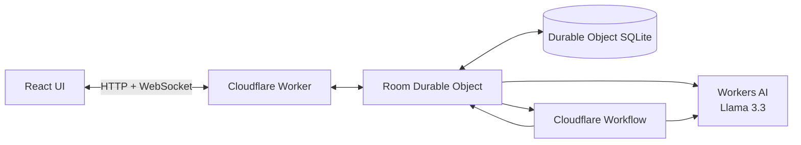

# Rally product and technical design

Status: MVP deployed; room-scoped link identity implemented

## Product promise

Rally helps a small group turn scattered preferences into one confirmed plan. An organizer describes a meetup in one sentence, shares an invitation, and lets Rally collect constraints through chat. Rally keeps a structured planning board beside the conversation, proposes viable options, runs a vote, and preserves the result.

## Audience

Rally is designed for groups of 3–12 people arranging one-off social plans such as dinners, hikes, game nights, birthday activities, and informal meetups.

## Design principles

1. Chat is the input; the planning board is the shared state.
2. Every extracted fact keeps its participant and message source.
3. Rally proposes and explains; the group decides.
4. The current stage and next action stay visible.
5. Reopening a room restores the same person and the complete state.
6. Identity comes from an unguessable participant token, never a display name.

## Identity and access

Rally deliberately has no global accounts in the MVP.

When an organizer creates a room, Rally creates a participant record and returns a private link:

```text
/room/<room-id>#access=<participant-token>
```

The organizer shares a different general invitation:

```text
/join/<room-id>#invite=<invitation-token>
```

A new participant opens the invitation, chooses a display name, and receives a distinct private return link. The same private URL restores that participant on a different browser. Two participants may use the same display name because their random tokens and participant IDs are different.

Both token types are 32 random bytes. The Durable Object stores only SHA-256 hashes. Fragments stay client-side when a page is requested; the client sends a token in an authorization header only to the relevant API call. Invitation links expire after 30 days. Organizers can revoke existing invitations by resetting them. Participants can rotate their return link, immediately invalidating the old token.

Recent rooms are a device-local convenience list. A user who loses both browser storage and their private link must rejoin from an invitation as a new participant. Email recovery and global room discovery are conscious post-MVP features.

## User flow

1. The organizer describes a plan and enters a display name.
2. Rally creates the room, extracts initial constraints, and opens the organizer’s private URL.
3. The organizer copies an invitation link.
4. Participants choose display names and join as distinct identities.
5. Messages update the room and its structured constraints in real time.
6. The organizer asks Rally to create three options.
7. A Cloudflare Workflow produces a versioned proposal set.
8. Participants vote; changing a vote replaces the previous choice.
9. The organizer finalizes the selected plan.
10. Each participant can return through their private URL.

## Cloudflare architecture



### Worker

The Worker serves the React application, validates room IDs, creates room Durable Objects, and forwards room-scoped API requests. It holds no identity database and sends no email.

### Room Durable Object

One Durable Object owns each room. It serializes mutations, stores canonical state in SQLite, validates participant and invitation tokens, manages hibernating WebSockets, broadcasts snapshots, and starts proposal Workflows.

### Workflow

Proposal generation captures the room’s state version, generates candidate plans, validates the model output, and commits only if that version is still current. Workflow IDs and proposal-set records make retries safe.

### Workers AI

`@cf/meta/llama-3.3-70b-instruct-fp8-fast` extracts constraints and generates proposals. Model output must pass Zod schemas before it changes application state. Local development uses deterministic fallbacks because Workers AI has no local emulator.

## Durable Object data model

```text
Room
  id, title, prompt, stage, state_version
  finalized_proposal_id, workflow_status, invite_required
  created_at, updated_at

Participant
  id, display_name, role, rsvp_status, token_hash
  joined_at, last_seen_at

Invitation
  id, token_hash, created_by_participant_id
  expires_at, revoked_at, created_at

Message
  id, participant_id, client_id, kind, body, created_at

Constraint
  id, participant_id, source_message_id
  type, value, strength, status, created_at, updated_at

ProposalSet / Proposal
  source_state_version, status, structured plan, tradeoffs, score

Vote
  proposal_id, participant_id, value, reason, created_at, updated_at

RoomEvent / WorkflowRun
  ordered audit events and durable execution references
```

Each room’s SQLite database is private and strongly consistent. Important state is written before broadcast. Existing rooms created before invitation enforcement retain their original join behavior through the `invite_required` migration default; all new rooms require invitation tokens.

## Permissions

| Action | Organizer | Participant | Invitation only |
| --- | ---: | ---: | ---: |
| Read room and chat | Yes | Yes | No |
| Send preferences | Yes | Yes | No |
| Vote | Yes | Yes | No |
| Generate proposals | Yes | No | No |
| Finalize a plan | Yes | No | No |
| Create/reset invitations | Yes | No | No |
| Join as a new participant | No | No | Yes |
| Rename self / rotate own link | Yes | Yes | No |

## Reliability

- Client-generated message IDs make retries idempotent.
- One current vote is stored per participant and proposal set.
- `state_version` prevents stale Workflow output from overwriting newer room state.
- WebSocket reconnect returns a canonical snapshot.
- Durable Object SQLite preserves state through eviction and restart.
- Workers AI failure falls back to deterministic local behavior for development and tests.

## Privacy boundaries

The room UUID routes to state but grants no access. Private and invitation tokens never appear in pathname or query-string server logs. Raw model output is not canonical state. The current MVP does not collect email addresses.

A copied private return link acts as the person who owns it, so the UI labels it clearly and provides rotation. An invitation creates a new participant and cannot authenticate as an existing person.

## MVP boundaries

The assignment version excludes public discovery, ticketing, payments, venue booking, maps, calendars, reminders, email recovery, recurring communities, and native mobile applications. These can be added without changing the room coordination model.

## Success criteria

1. Three people can join from separate browser sessions.
2. Same-name participants remain distinct.
3. A private link restores exactly one participant in a fresh browser.
4. Chat and structured constraints update in real time and survive reconnects.
5. The Workflow produces a valid proposal set for the captured room version.
6. Participants vote and the organizer finalizes a plan.
7. A reviewer can identify the LLM, coordination, user input, and persistent-state components.
